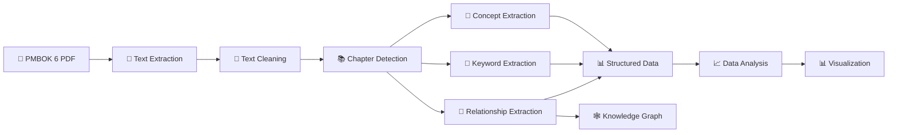

📊 PMBOK Risk Management – NLP Analysis
<p align="center">
  
  
  
  
  
</p>
<p align="center">
  <strong>NLP-based extraction of concepts, keywords and semantic relationships from PMBOK 6</strong>
</p>
---
🎯 Project Overview
This project applies Natural Language Processing (NLP) techniques to the PMBOK® Guide – Sixth Edition in order to transform unstructured project management knowledge into structured information.
The objective is to extract meaningful information from a large knowledge base and make it easier to analyze, explore and visualize.
The analysis focuses on
🔹 Concept extraction
🔹 Keyword extraction
🔹 Semantic relationships
🔹 Subject–Verb–Object (SVO) triplets
🔹 Knowledge graph information
🔹 Chapter-level analysis
---
🖼️ Project Workflow

---
🔄 NLP Pipeline
The project follows a multi-stage NLP workflow:
Stage	Description
📄 Text Extraction	Extract textual content from the PMBOK document
🧹 Text Cleaning	Prepare and normalize the extracted text
📚 Chapter Detection	Identify and organize content by chapter
🧠 Concept Extraction	Identify relevant project-management concepts
🔑 Keyword Extraction	Extract important terms using NLP techniques
🔗 Relationship Extraction	Identify semantic relationships between concepts
📊 Structured Data	Transform extracted information into structured datasets
📈 Visualization	Analyze and communicate the extracted information
🕸️ Knowledge Graph	Represent relationships between concepts
---
📊 Key Results
The NLP pipeline produces structured information that can be analyzed at different levels.
Concepts by Chapter
The following results represent the number of extracted concepts associated with each PMBOK chapter.
Chapter	Concepts
Chapter 11 – Risk Management	22
Chapter 6 – Project Scope	18
Chapter 12 – Procurement	15
Chapter 5 – Project Schedule	14
Chapter 10 – Communication	12
Chapter 4 – Project Integration	11
Chapter 8 – Project Quality	10
Chapter 13 – Stakeholder Management	9
Chapter 7 – Project Cost	8
Chapter 9 – Project Human Resource	7
Chapter 3 – Project Time Management	6
Chapter 2 – Project Management Framework	5
Chapter 1 – Introduction	4
📌 Main Observation
Chapter 11 – Risk Management contains the highest number of extracted concepts in the analyzed results, followed by Project Scope and Procurement.
---
🔑 Keyword Extraction
The project uses NLP-based keyword extraction to identify the most relevant terms appearing throughout the document.
These keywords provide an additional layer of analysis by highlighting the main topics and terminology contained within the project management knowledge base.
---
🔗 Semantic Relationship Extraction
The project also extracts relationships between concepts.
Relationships can be represented using:
```text
Subject → Relationship → Object
```
This allows textual information to be transformed into structured relationships that can later be used for knowledge graph construction and exploration.
---
🕸️ Knowledge Graph
The extracted relationships can be represented as a knowledge graph where:
```text
Concept
   │
   ├── Relationship ──► Concept
   │
   ├── Relationship ──► Concept
   │
   └── Relationship ──► Concept
```
This provides a structured representation of how project management concepts are connected.
---
🛠️ Technologies
Programming & Data
Python
Pandas
NumPy
Scikit-learn
NLP & Machine Learning
KeyBERT
Sentence Transformers
Transformers
BERTScore
spaCy
NLTK
Textacy
Document Processing
PyMuPDF
PyPDF2
Knowledge Representation
RDFLib
FAISS
Development Environment
Google Colab
---
📁 Project Structure
```text
Risk-Management/
│
├── 📂 Notebooks/
│   └── 📓 Risk_Management.ipynb
│
├── 📂 src/
│   └── 🐍 risk_management.py
│
├── 📄 requirements.txt
├── 📄 README.md
├── 📄 LICENSE
└── 📄 .gitignore
```
---
📓 Notebook
The main analysis is available in:
```text
Notebooks/Risk_Management.ipynb
```
The notebook contains the NLP workflow, processing steps, analysis and generated outputs.
It can be visualized directly on GitHub without requiring the project to be executed.
---
📈 From NLP to Data Visualization
One of the objectives of this project is to demonstrate how unstructured textual information can be transformed into structured data suitable for analysis and visualization.
```text
Unstructured Knowledge
        ↓
       NLP
        ↓
Information Extraction
        ↓
Structured Data
        ↓
Data Analysis
        ↓
Business Visualization
```
This creates a bridge between:
NLP → Data Processing → Knowledge Extraction → Data Visualization
---
📄 Data Source
The analysis is based on:
> *A Guide to the Project Management Body of Knowledge (PMBOK® Guide) – Sixth Edition*
The original PMBOK document is not included in this repository.
---
🎯 Project Objective
This project demonstrates how NLP and data-processing techniques can be applied to a large unstructured knowledge source in order to:
Extract meaningful concepts
Identify important keywords
Discover relationships between concepts
Structure textual information
Prepare information for visualization
Explore the potential of knowledge graphs
---
🚀 Skills Demonstrated
Data Processing
Document processing
Text preprocessing
Structured data transformation
NLP
Keyword extraction
Concept extraction
Semantic analysis
Relationship extraction
Data & AI
Machine learning libraries
Transformer-based models
Vector representations
Knowledge representation
Data Visualization
Chapter-level analysis
Structured analytical datasets
Business-oriented visualization
---
👤 Author
Oussama Fdhila
IT Engineer specialized in Data
---
<p align="center">
  ⭐ If you find this project interesting, feel free to explore the notebook and source code.
</p>
